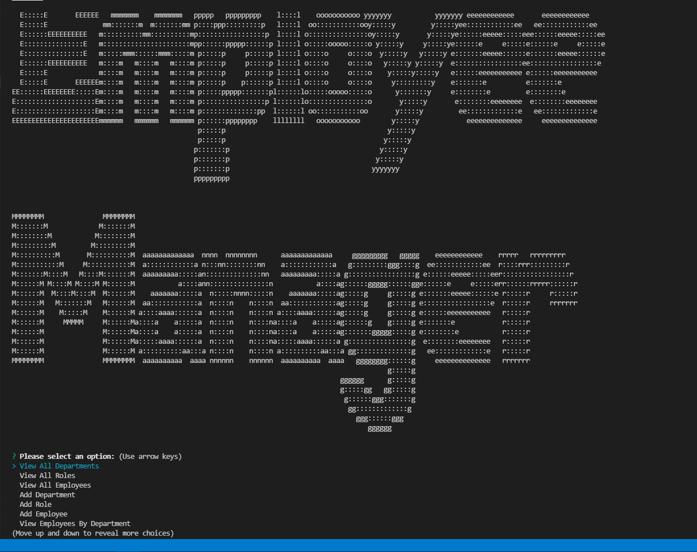

<h1 align="center">Employee Tracker App Using MySQL, Inquirer, Console.Table, Express, & Node.</h1>

    
    
    
    
 

 
## Description

A node.js application that takes user input with inquirer to populate an employee tracker MySQL database displaying all company info.

Bleow is a gif of it in live-action.

The full movie file showing functionality found here (https://drive.google.com/file/d/1BTqXw4wFj3bWPZISSX4_pIfK0WUbJ9M8/view)

## Installation
  
`npm init`
  
 `npm install inquirer mysql2 console.table validator express dotenv`

  ## Useage
  
  at the command line in the root folder type:
  `npm start`
